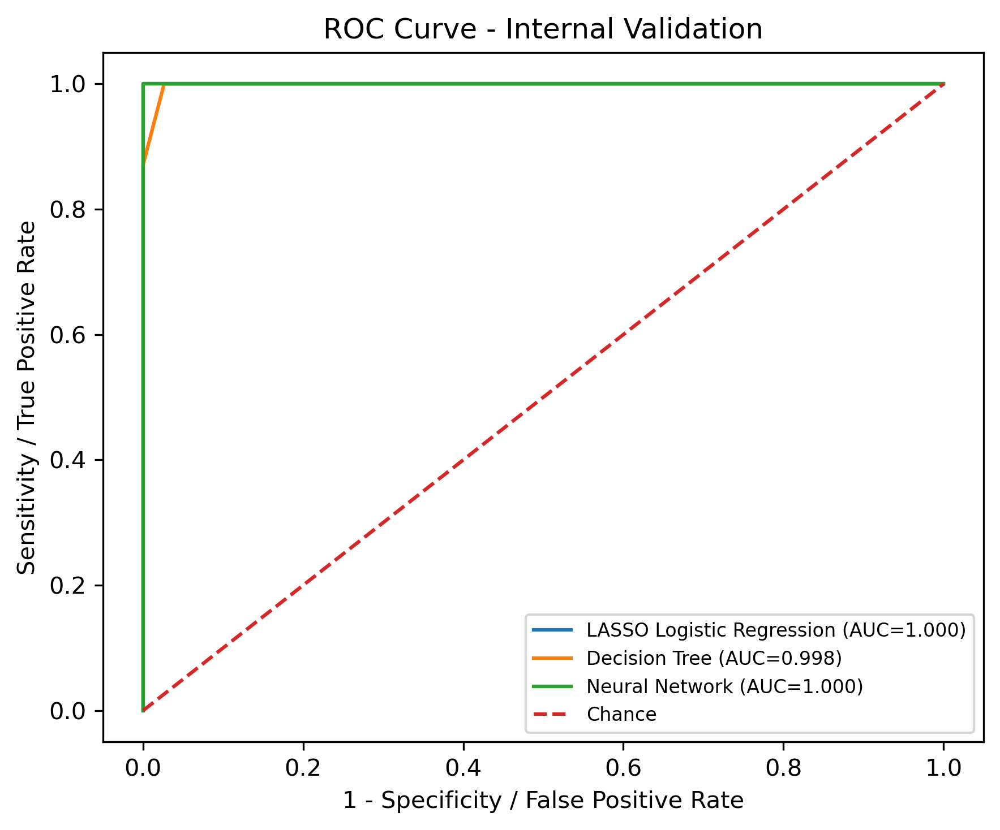
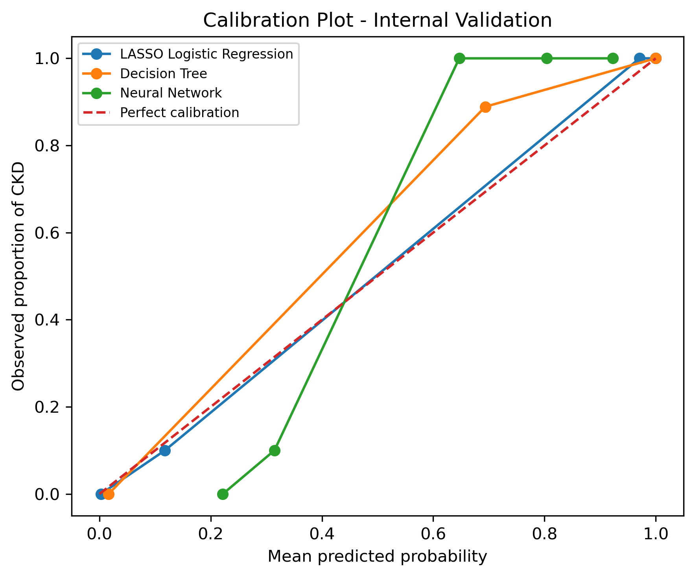
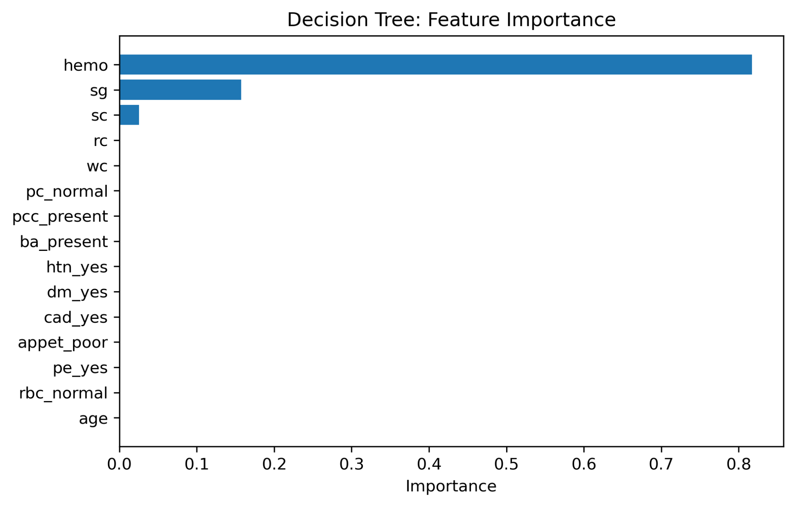

# Chronic Kidney Disease Prediction Using Machine Learning


[](LICENSE)

An end-to-end health data science project comparing **LASSO logistic regression**, **decision tree**, and **neural network** models for chronic kidney disease (CKD) prediction. The workflow covers preprocessing, model tuning, internal validation, calibration, discrimination, and model interpretation.

**Author:** Mohammad Maliki Rafli  
**Program:** Master of Public Health, Universitas Airlangga

## Table of Contents

- [Project Overview](#project-overview)
- [Project Presentation](#project-presentation)
- [Research Objective](#research-objective)
- [Repository Structure](#repository-structure)
- [Analytical Workflow](#analytical-workflow)
- [Models and Evaluation](#models-and-evaluation)
- [Key Results](#key-results)
- [Selected Visualizations](#selected-visualizations)
- [Data Privacy](#data-privacy)
- [Reproducing the Analysis](#reproducing-the-analysis)
- [Limitations](#limitations)
- [Conclusion](#conclusion)
- [Recommendations](#recommendations)
- [License and Academic Use](#license-and-academic-use)
- [Contact](#contact)

## Project Overview

Chronic kidney disease is a major public health concern that benefits from timely risk identification. This project evaluates three supervised classification approaches with different strengths:

- **LASSO logistic regression** for parsimony and interpretability.
- **Decision tree** for transparent nonlinear decision rules.
- **Neural network** for flexible modeling of complex relationships.

The repository contains the analytical report, a sanitized and reproducible notebook, aggregate validation results, and publication-ready figures. Individual-level health data are intentionally excluded.

## Research Objective

To develop and internally validate machine-learning models for CKD classification, compare their predictive performance, and assess the trade-off between discrimination, calibration, and interpretability.

## Repository Structure

```text
.
├── 01_Laporan/
│   └── CKD_Machine_Learning_Report_Mohammad_Maliki_Rafli.pdf
├── 02_Script/
│   └── CKD_Machine_Learning_Analysis.ipynb
├── 04_Output/
│   ├── *.csv    # Aggregate metrics, coefficients, and summaries
│   └── *.png    # Model diagnostics and visualizations
├── 05_Presentation/
│   └── CKD_Prediction_Model_Comparison.pdf
├── .gitignore
├── LICENSE
├── README.md
└── requirements.txt
```

The `03_Data/` directory is excluded from version control to prevent redistribution of individual-level health data.

## Project Presentation

- [View the presentation as PDF](05_Presentation/CKD_Prediction_Model_Comparison.pdf)
- [Read the complete analytical report](01_Laporan/CKD_Machine_Learning_Report_Mohammad_Maliki_Rafli.pdf)

## Analytical Workflow

1. Inspect variables and missingness.
2. Create a stratified development and internal-validation split.
3. Build preprocessing and modeling pipelines to reduce data leakage.
4. Tune hyperparameters using stratified cross-validation.
5. Fit LASSO logistic regression, decision tree, and neural network models.
6. Evaluate discrimination, calibration, and classification performance.
7. Examine coefficients and feature importance for interpretation.
8. Estimate uncertainty using bootstrap confidence intervals.

## Models and Evaluation

### Models

- LASSO-penalized logistic regression
- Decision tree classifier
- Multilayer perceptron neural network

### Evaluation metrics

- Accuracy and balanced accuracy
- Sensitivity and specificity
- Precision and F1 score
- Area under the ROC curve (AUC)
- Brier score
- Calibration intercept and slope
- Bootstrap confidence intervals

## Key Results

| Model | Accuracy | Sensitivity | Specificity | F1 score | AUC | Brier score |
|---|---:|---:|---:|---:|---:|---:|
| LASSO logistic regression | 1.00 | 1.00 | 1.00 | 1.000 | 1.000 | 0.0016 |
| Decision tree | 0.99 | 1.00 | 0.974 | 0.992 | 0.998 | 0.0124 |
| Neural network | 0.98 | 0.968 | 1.00 | 0.984 | 1.000 | 0.0665 |

LASSO logistic regression produced the strongest overall internal-validation profile, combining excellent discrimination with the lowest Brier score. The near-perfect results should be interpreted cautiously because they come from internal validation and may reflect the characteristics of this dataset.

## Selected Visualizations

### ROC curves



### Calibration



### Decision-tree feature importance



## Data Privacy

This public repository does **not** distribute:

- the individual-level CKD dataset;
- row-level predicted probabilities;
- row-level validation labels; or
- notebook outputs containing clinical records.

Only code, aggregate results, and non-identifiable visualizations are published. The notebook outputs were cleared before publication.

## Reproducing the Analysis

1. Clone the repository:

   ```bash
   git clone https://github.com/mohmalikirafli/chronic-kidney-disease-ml-prediction.git
   cd chronic-kidney-disease-ml-prediction
   ```

2. Create and activate a virtual environment.

3. Install the required packages:

   ```bash
   pip install -r requirements.txt
   ```

4. Create `03_Data/` and place the authorized dataset at:

   ```text
   03_Data/data_uas_kidney_disease.csv
   ```

5. Open `02_Script/CKD_Machine_Learning_Analysis.ipynb` and run the cells sequentially.

## Limitations

- Performance was assessed through internal validation only.
- Very high predictive performance may indicate optimism or dataset-specific separation.
- External validity across populations, healthcare settings, and measurement systems remains unknown.
- The models are intended for academic analysis and are not clinical decision-support tools.

## Conclusion

All three approaches demonstrated strong CKD classification performance. LASSO logistic regression offered the best balance of predictive accuracy, calibration, and interpretability in the internal-validation sample. Decision tree and neural network models provided useful complementary perspectives on nonlinear structure and variable importance.

## Recommendations

- Conduct external validation using an independent population.
- Evaluate temporal and geographic transportability.
- Assess clinical utility using decision-curve analysis.
- Compare model performance after stronger regularization and repeated resampling.
- Report uncertainty and calibration alongside discrimination before considering practical use.

## License and Academic Use

The source code in this repository is available under the [MIT License](LICENSE). You may use, modify, and distribute the code provided that the original copyright and license notice are retained.

The report, presentation, figures, and other academic materials remain the intellectual work of the author. When adapting or referencing these materials, please provide appropriate attribution. The contents are intended for education, research, and portfolio demonstration—not for clinical diagnosis or medical decision-making.

The dataset is **not included** in the license or distributed through this repository because of data-access and privacy considerations.

## Contact

For questions, academic discussion, collaboration, or legitimate inquiries about data access, please contact **Mohammad Maliki Rafli** through the [GitHub profile](https://github.com/mohmalikirafli) or open an [issue](https://github.com/mohmalikirafli/chronic-kidney-disease-ml-prediction/issues) in this repository.

---

This repository is intended for academic and portfolio purposes in biostatistics and health data science.
